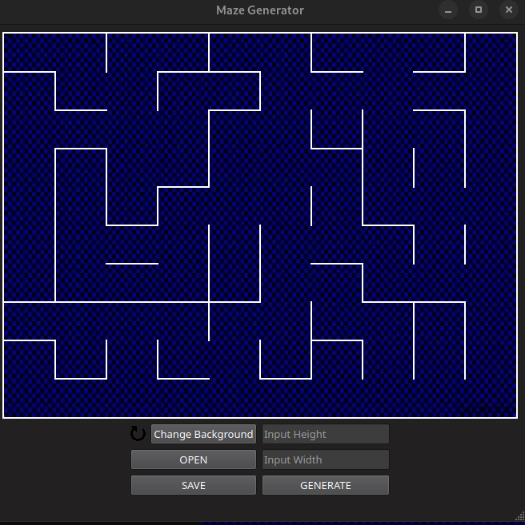

# LabyrinthGenerator
create different mazes in one click

program ui 0.002 :)

# TODO
1) add separate change-background window, that contains 
   some pre-implemented background images
    1.1) In qt i'm going to need [click FlowLayout](https://doc.qt.io/qt-5/qtwidgets-layouts-flowlayout-example.html), that dynamicly change 
         amount of widgets in one line.
    1.2) implement FlowLayout as separate dll.

2) implement app frontend
